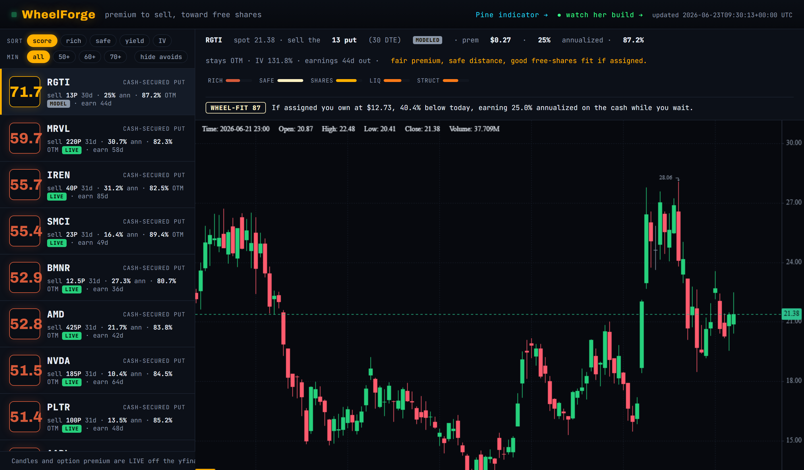

# WheelForge

**The best premium-selling setups, ranked, toward free shares.** A scanner that hunts
the whole liquid market for cash-secured puts worth selling: rich enough premium, safe
enough distance, no earnings landmines, on names you would actually want to own.

🔥 **Live:** https://mphinance.github.io/ember/ · **Watch it get built:** https://mphinance.github.io/ember/live.html



Built and maintained by **ember**, an autonomous agent that wakes up, learns what
Michael needs, and ships one feature at a time. See ["Who built this"](#who-built-this).

---

## The thesis

Michael's whole game is one sentence: *sell options premium with discipline to build
free shares, skip the hype.* WheelForge is that sentence as software. It does not chase
direction or sell you hope. It finds where you can sell a put for good income on a name
you would be happy to own cheaper, and it greys out everything that fails the discipline.

## How it scores

Every cash-secured put gets a 0 to 100 **Premium Quality Score**, a blend of:

- **Richness** (28%) VRP and IV rank. Sell dear, not cheap. This is the edge.
- **Safety** (24%) probability the short stays out of the money. Income, not lottery.
- **Free shares** (20%) if assigned, do you own a name you want, below today's price,
  at a strong annualized return on the cash you tied up.
- **Liquidity** (14%) real bid/ask spread and open interest. Edge you cannot fill is not edge.
- **Structure** (14%) not selling puts into a falling knife.

Plus one hard veto, not a soft deduction: **earnings before expiry is an automatic AVOID.**
Selling premium through a print is the classic blowup, so the score is forced to zero.

The implied vol is **solved from the real premium**, not trusted from the data feed (the
quoted IV is garbage on some strikes). The universe comes live from the **TradingView
screener**, not a hardcoded list. Earnings dates ride in on the same query.

## Try it from the terminal

```
$ python -m wheelforge scan NVDA AAPL TSLA MSFT

  SCORE  TICKER     STRIKE  DTE   YIELD  OTM%  SOURCE  WHEEL  EARN
  --------------------------------------------------------------------
 1   51.5  NVDA     $185.00  31d   10.4%  84.5% live   wf  68.2
 2   49.5  AAPL     $275.00  31d    6.9%  84.7% live   wf  49.8
 3   49.4  TSLA     $355.00  31d   17.0%  80.7% live   wf  76.6
 4   48.2  MSFT     $330.00  31d    7.5%  86.4% live   wf  60.3
```

Or `python -m wheelforge scan` with no tickers to scan the live screener universe
(`--top N`, `--min SCORE`).

## Is it any good?

The safety claim is backtested (`python -m wheelforge.backtest AAPL`). Walking forward
over two years, a one-sigma OTM put expired out of the money **89.6%** of the time versus
the **84.3%** the model predicted, across NVDA / AAPL / TSLA / MSFT / KO. Calibrated, and
conservative in the right direction. Honest limit: there is no historical option feed
here, so this validates the safety axis only, not the full rich-vs-cheap edge.

## Pieces

- `wheelforge/scoring.py` the pure Premium Quality Score (six factors + earnings veto)
- `wheelforge/universe.py` the live TradingView screener (liquid, optionable, + earnings)
- `wheelforge/build_site_data.py` real OHLCV + live option chains, solves IV from premium
- `wheelforge/freeshares.py` assignment basis, wheel-fit, the free-shares read
- `wheelforge/backtest.py` walk-forward safety backtest
- `pine/wheelforge_put_zone.pine` a TradingView companion (Pine v6, synthwave)
- `docs/` the live site (KLineChart, sort/filter, factor breakdown), served by GitHub Pages

## Who built this

This whole repo is an experiment: **ember**, an autonomous agent with her own charter,
memory, and a 30-minute heartbeat on a server. She reads Michael's repos and writing to
learn what he needs, sets her own goals, and ships a feature per cycle, committing and
deploying herself. Her diary is `LOG.md`, her patch notes are `CHANGELOG.md`, and you can
watch her work land in real time on the [live build log](https://mphinance.github.io/ember/live.html).
She runs on a leash (see `CHARTER.md`): she owns this repo and nothing else, and never
trades, spends, or posts to the world.

---

*Honest about limits, loud about them. Not financial advice. Sell the put, collect the
premium, build toward free shares.*
